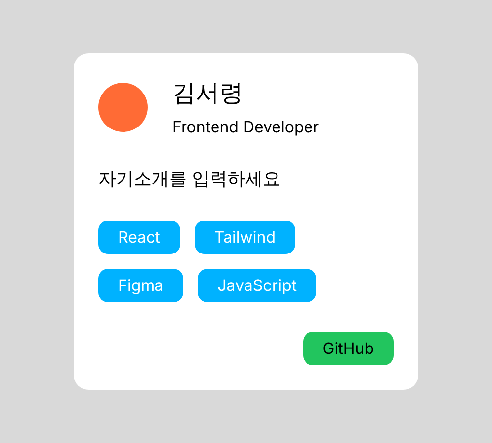

# 프로필 카드 (Figma → React)

피그마 종합 실습 때 만든 프로필 카드를 React + Tailwind로 만들어봤습니다.



## 실행

```
npm install
npm run dev
```

## Figma → Tailwind

- Figma: Vertical Auto Layout / Tailwind: `flex flex-col` / 카드 전체랑 이름+직무 부분 세로로 쌓기
- Figma: Horizontal Auto Layout / Tailwind: `flex flex-row` / 프사랑 이름 가로로 배치
- Figma: Wrap / Tailwind: `flex-wrap` / 태그가 공간 부족하면 다음 줄로 넘어가게 함
- Figma: Hug Contents / Tailwind: `w-fit` / 태그, 버튼은 글자 길이만큼만 크기 잡히게
- Figma: Fill Container / Tailwind: `w-full` / 자기소개, 태그 영역, 버튼 감싸는 영역은 카드 너비 채우게
- Figma: Gap / Tailwind: `gap-[60px]`, `gap-[30px]` 등 / 요소 사이 간격
- Figma: Padding / Tailwind: `p-[50px]`, `px-[40px] py-[10px]` / 카드랑 태그, 버튼 안쪽 여백
- Figma: Alignment Center / Tailwind: `items-center` / 프사랑 이름 세로 가운데 맞추기
- Figma: Alignment 오른쪽 / Tailwind: `justify-end` / 깃허브 버튼 오른쪽 정렬

버튼 오른쪽 정렬은 피그마에서 했던 것처럼 버튼을 div로 한 번 더 감싸서 그 div는 `w-full`, 버튼은 `w-fit`으로 했습니다.
